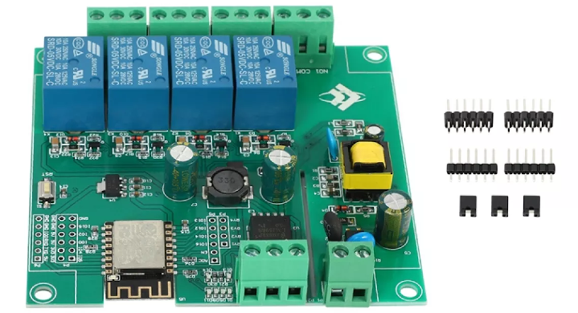

# MQTT for ESP12F RELAY X4 Board
This software implements MQTT functionalities for the board showed in picture. This module has a onboard ESP12F (ESP8266) to connection with WiFi and four relays controlled by GPIO's. 

This project was developped using [PlatformIO IDE](platformio.org).



## Usage

 MQTT payload is in JSON format, was described below:

 ```json
 {
   "ry1":1,
   "ry2":0,
   "ry3":0,
   "ry4":0
 } 
 ```
Otheway, only a piece of fields above described can be sent, was show below:

 ```json
 {
   "ry1":1
 } 
 ```

In each change, a publish is launched on a status topic with the complete JSON format.

## Configuration

To properly work, some changes need to be done, but not worry, it's simple.

```C
char* ssid = (char*)"your ssid";
char* password = (char*)"your password";
char* mqttServer = (char*)"your mktt server ";
char* topic = (char*)"your action topic";
char* topic_status = (char*)"your status topic";
int mqttPort = 1883; // Usually 1883 port is used
```
